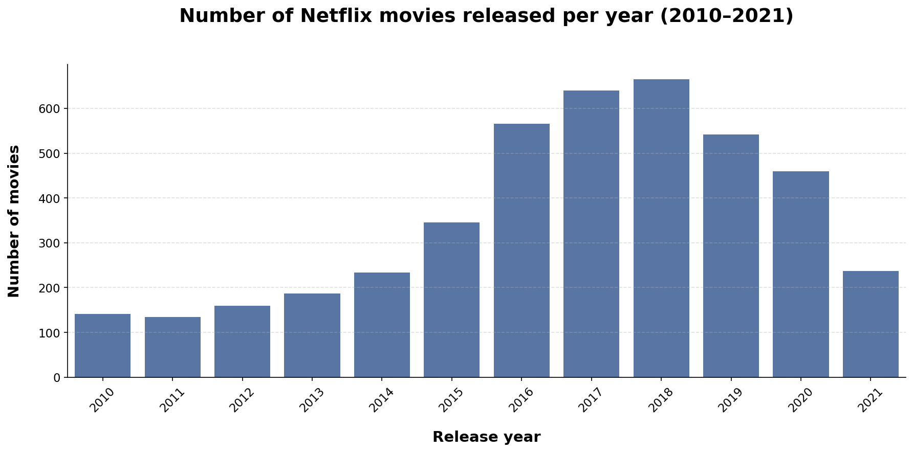
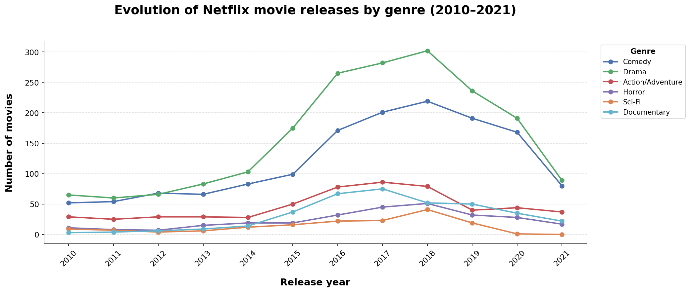

# Netflix movies and shows (2010-2021)

This is an analysis of the movies and shows of Netflix from the period 2010-2021. It covers the distribution of genres, directors and actors, showing how the genres of the titles vary over time and country, and who are the most popular directors and actors overall and for each type of genre.

## Movies

# Movie releases per year
We start by checking how many movies were released each year. We can see that the number increases each year, with the bigger shift happening between 2015 and 2016. After 2018, the number starts to drop, with the biggest decrease between 2020 and 2021. Personally, I would have expected the number of movies to increase during the pandemic, since one could argue that it would have been in Netflix's best interest to take advantage of the fact that people couldn't go to the theaters; nonetheless, it was also much more difficult to produce the movies because of all the protocols that had to be implemented to minimize contagions, so that gives this result more sense.

# Movie releases per year and genre
Now that we saw the evolution of movie releases overall, let's see the releases segmented by genre. As the graphic shows, drama and comedy are the genres with the most increase throughout the years, meaning they are the most demanded types of genres. Again, it's visible the huge drop in releases after 2019.
If we look closely, we see that the genre "action" is not shown in the chart. That's because every movie labeled as "adventure" in Netflix also has the label "action"; therefore, all adventure movies are also action movies and vice versa, which results in the two genres overlapping, and "action" remaining hidden below "adventure".

# Distribution of genres by country
Let's check the popularuty of each genre by country. Of course, I didn't consider all the countries in the dataset, since that would have been chaotic. I took a sample of 11 countries to show. It's evident that drama and comedy are the most popular types of movies in most countries, with exceptions like Japan in which action/adventure win.
